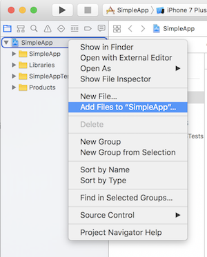

# React Native dotenv

Add .env support to your react-native application without exposing them in JavaScript bundle.

**NOTE: Android not supported yet, feel free to contribute :)**

## Motivation

TBD

## Installation

```sh
yarn add react-native-dot-env
# or
npm install --save react-native-dot-env
```

### Automatically link

```sh
react-native link react-native-dot-env
```

### Manually link

#### iOS with CocoaPods

Add the following line to your build targets in your `Podfile`

`pod 'RNDotEnv', :path => '../node_modules/react-native-dot-env/ios'`

Then run `pod install`

#### Android

Sorry, Android is not supported yet.

## Getting started

1. Create a new React Native App

  ```sh
  react-native init SimpleApp
  cd SimpleApp
  ```

2. Install the latest version of react-native-dot-env

  ```sh
  yarn add react-native-dot-env
  # or via npm
  # npm install --save react-native-dot-env
  react-native link react-native-dot-env
  ```

3. Create .env file(s) and add them to .gitignore

  ```sh
  echo "API_URL=http://localhost" > .env
  touch ios/.env.plist
  echo ".env*" >> .gitignore
  ```

4. Add newly created `.env.plist` to Xcode project

  - `open ios/SimpleApp.xcodeproj`
  - In Project navigator right click on project `SimpleApp` (root item) and choose `Add Files to "SimpleApp"`
  -  Add the newly created `.env.plist` (in MacOS you can show hidden file with `⌘+shift+.`)
  
  

5. Add `Run script` in Project `Build phases`

  - it has to be above `Copy Bundle resources` (see attached image)

  ```sh
  node ../node_modules/react-native-dot-env/cli.js -e ../.env -d $SRCROOT
  ```
  
  
  
6. Add to application source code

  ```js
  import dotenv from 'react-native-dot-env'

  dotenv()

  console.log(process.env)
  ```

7. Run App

  ```sh
  react-native run-ios
  ```
